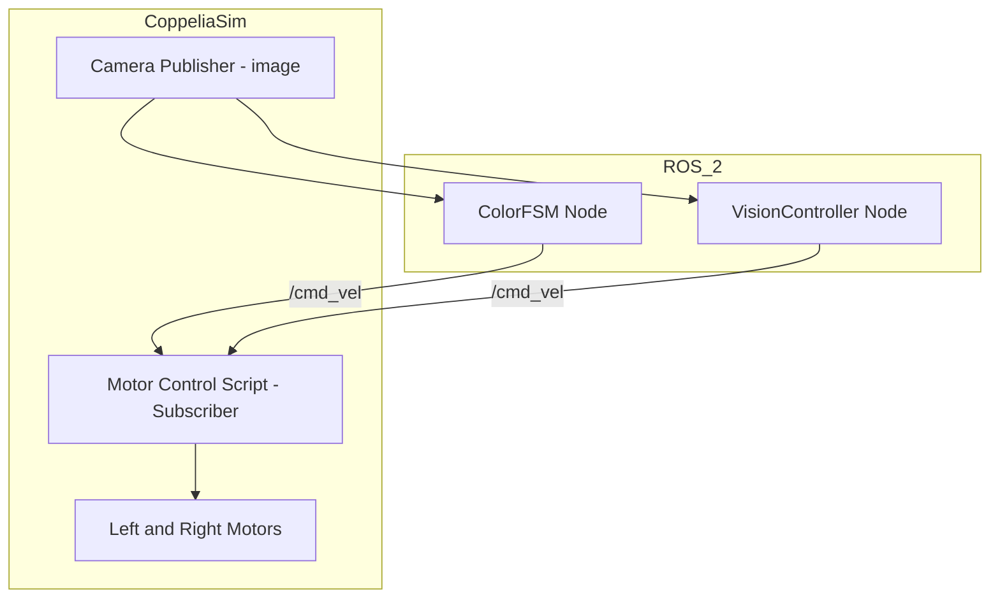

# 🤖 ROS2 - CoppeliaSim DiffDrive Vision Workspace

Este repositorio contiene un sistema de control visual para un robot diferencial simulado en **CoppeliaSim**, implementado en **ROS 2**. El comportamiento del robot está gobernado por visión por computadora a través de dos nodos:

- `color_fsm`: Máquina de estados finita basada en colores (verde, naranja, azul, amarillo)
- `vision_controller_node`: Seguimiento proporcional de una esfera roja

El robot se controla mediante el tópico `/cmd_vel`, el cual es interpretado por un script embebido en CoppeliaSim que aplica velocidades a las ruedas.

---

### 🎥 Video Demonstration of Sphere-Following Diff-Robot [click the image]

[](https://youtu.be/rvQTukPbEp0)

---

## 🧠 Nodos de Control

### 🎨 `color_fsm` – Finite State Machine por Color

Este nodo implementa una máquina de estados basada en el color detectado en la imagen. Cambia su comportamiento según el color:

- 🟢 Verde: Avanza o ajusta dirección si está desalineado
- 🟠 Naranja: Gira a la derecha
- 🔵 Azul: Gira a la izquierda
- 🟡 Amarillo: Se detiene por 5 segundos
- ⚫ Sin color: Detiene el robot

**Detalles:**
- **Subscrito a:** `/image` (`sensor_msgs/Image`)
- **Publica a:** `/cmd_vel` (`geometry_msgs/Twist`)
- **Tecnologías:** `cv_bridge`, OpenCV, detección HSV

```bash
ros2 run coppeliasim_diffdrive color_fsm
```

---

### 🔴 `vision_controller_node` – Seguimiento de Esfera Roja

Este nodo realiza seguimiento visual a una esfera roja mediante control proporcional, ajustando velocidad lineal y angular según el área y posición del objeto.

- Controla error horizontal con filtro EMA
- Controla distancia con proporcional al área del contorno
- Si pierde el objeto, gira en la última dirección conocida

**Detalles:**
- **Subscrito a:** `/image`
- **Publica a:** `/cmd_vel`
- **Parámetros:** `k_p`, `k_dist`, `v_max`, `alpha`, `target_area`

```bash
ros2 run coppeliasim_diffdrive vision_controller_node
```

---

## 🧩 Interfaz ROS 2 embebida en CoppeliaSim

Este script Lua ejecutado dentro de CoppeliaSim escucha `/cmd_vel` y aplica directamente las velocidades calculadas a las ruedas del robot simulado.

### 📡 Cómo Funciona

1. Recibe mensajes `Twist` desde ROS 2.
2. Convierte velocidades lineales y angulares a velocidades de rueda.
3. Usa `sim.setJointTargetVelocity` para mover los motores.

### 🧾 Código Python del subscriber

```python
import rclpy
from rclpy.node import Node
from geometry_msgs.msg import Twist

class Subscriber(Node):
    def __init__(self, cmd_vel):
        super().__init__('subscriber_cmd_vel')
        self.subscription = self.create_subscription(Twist, cmd_vel, self.callback, 10)
        self.leftMotor = sim.getObject('./leftMotor')
        self.rightMotor = sim.getObject('./rightMotor')

    def callback(self, msg):
        linear_vel = msg.linear.x
        angular_vel = msg.angular.z
        leftVel, rightVel = self.obtainVelocities(linear_vel, angular_vel)
        sim.setJointTargetVelocity(self.leftMotor, leftVel)
        sim.setJointTargetVelocity(self.rightMotor, rightVel)

    def obtainVelocities(self, linear, angular):
        wheel_radius = 0.097
        wheel_base = 0.1155
        v_left = linear - (angular * wheel_base / 2.0)
        v_right = linear + (angular * wheel_base / 2.0)
        return v_left / wheel_radius, v_right / wheel_radius

def sysCall_init():
    sim = require('sim')
    simROS2 = require('simROS2')
    rclpy.init()
    self.subscriber_node = Subscriber('cmd_vel')

def sysCall_sensing():
    rclpy.spin_once(self.subscriber_node, timeout_sec=0)

def sysCall_cleanup():
    self.subscriber_node.destroy_node()
    rclpy.shutdown()
```

---

## 🔁 Diagrama de Flujo del Sistema




---

## 📦 Requisitos

- ROS 2 (Humble o superior)
- CoppeliaSim (con `simROS2` plugin activo)
- `cv_bridge`, `OpenCV`, `sensor_msgs`, `geometry_msgs`

---

## 📄 Licencia

MIT License

---

## 🤝 Contribuciones

Pull requests y sugerencias son bienvenidas. Para cambios importantes, abre primero una issue para discutir lo que deseas proponer.
